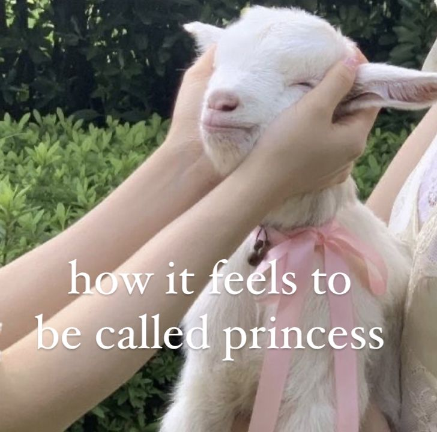
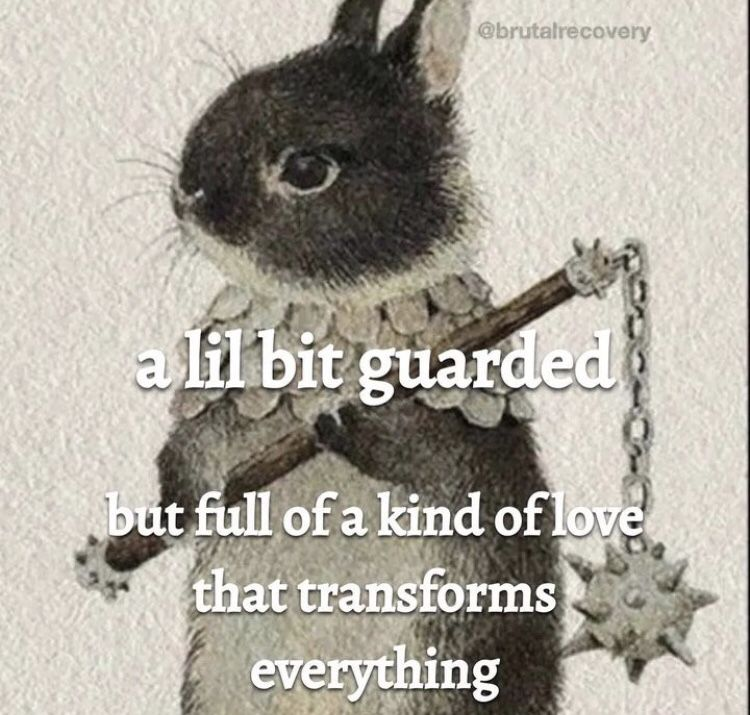

.. _target1:

Chapter 1
===========================================

This chapter serves as sample page to detail various formatting options using reStructuredText.

Formatting lists
-------------------------------------
Here is a list in bullet points:
 * Item 1
 * Item 2
 * Item 3

Here is a numerical list:
 1. Item 1
 2. Item 2
 3. Item 3

Inserting/adding media
-----------------------------------------

We use **directives** to insert media (photos, videos, etc.) 

Inserting an image:
```````````````````````````````````````````
1. Create a folder for all images in this documentation inside the **source directory**
2. Save your image in that folder
3. Go back to the .rst and where you want this image inserted (check out the .rst to see what to type in)

Inserting an image with a caption:


        
   This is the caption

Inserting an image without a caption:



Inserting an inline image:

This is a sentence where I am putting a simple inline icon between words batman |light-bulb| and cactus.

.. |light-bulb| image:: _images/light-bulb.png
   :scale: 4%

Inserting a youtube video:
```````````````````````````````````````````````````
This is the video I'm currently on in this tutorial:

.. raw:: html

    <iframe width="560" height="315" src="https://www.youtube.com/embed/CqR1b0Y-o5k?si=C_gVb8Uahi0VBXzK" title="YouTube video player" frameborder="0" allow="accelerometer; autoplay; clipboard-write; encrypted-media; gyroscope; picture-in-picture; web-share" allowfullscreen></iframe>


